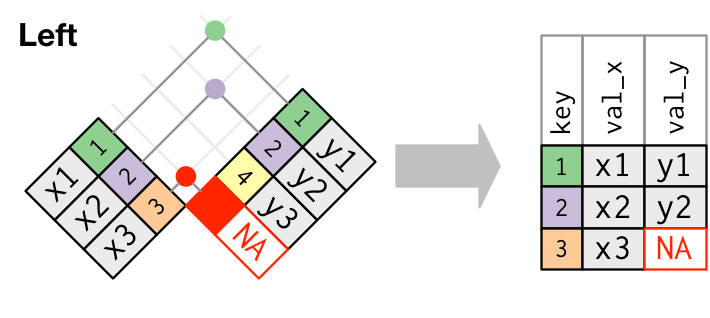
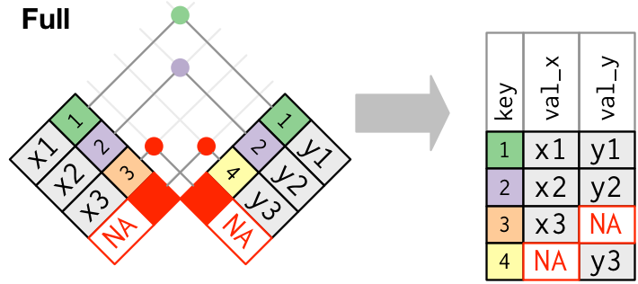
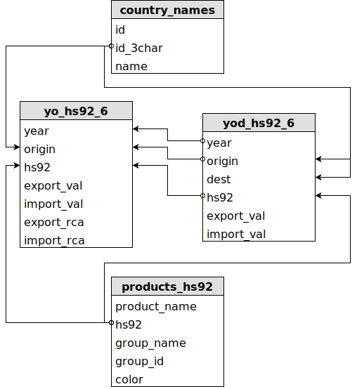

# Repaso clase anterior

Abre RStudio Server, ve a File &rarr; New Project, crea un nuevo proyecto con tu nombre en un nuevo directorio (e.g *mauricio_vargas_clase_2*) y crea un nuevo script.

Vamos a usar el archivo [clase2_vuelos.zip](https://goo.gl/6hTX5o) y lo vamos a descargar al directorio "datasets" y leer desde R.

Pasos a seguir:

1. Cargar los paquetes de la clase anterior
2. Crear el directorio "datasets" y descargar el archivo si y sólo si este no está en el directorio "datasets"
3. Leer el archivo CSV usando la función `read_csv` (una función del paquete `readr`) para obtener
  3.1. Los vuelos del día 1 de enero
  3.2. Los vuelos del día 25 de diciembre

---

## Desarrollo repaso

### Paso 1:


```r
if (!require("pacman")) install.packages("pacman")

p_load(readr,readxl,dplyr,ggplot2,forcats)
```

---
  
## Desarrollo repaso

### Paso 2:  


```r
folder = "datasets/"
zip    = paste0(folder,"clase2_vuelos.zip")
csv    = paste0(folder,"clase2_vuelos.csv")

try(dir.create(folder))

if(!file.exists(zip)) {
  download.file(
    "https://goo.gl/6hTX5o",
    zip)
}

if(!file.exists(csv)) {
  system(paste0("7z e ",zip," -oc:",folder))
}
```

---

## Desarrollo repaso

### Paso 3:


```r
flights = read_csv(csv)
filter(flights, month == 1, day == 1)
filter(flights, month == 12, day == 25)
```

---

# Operadores lógicos


---

## Tarea Nº1

Sobre el dataset del ejemplo de repaso obten los vuelos de los meses noviembre o diciembre de las siguientes formas:

1. Usando el operador "ó" (`|`)
2. Usando el operador "pertenece" (`%in%`)

---

## Desarrollo Tarea Nº1


```r
### forma 1
filter(flights, month == 11 | month == 12)

### forma 2
filter(flights, month %in% c(11,12))
```

---

## Tarea Nº2

Sobre el dataset del ejemplo de repaso obten los vuelos que no estuvieron atrasados por más de dos horas en la llegada o la partida de las siguientes formas:

1. Usando una negación explícita (e.g. "no está en el grupo de los que tienen más de 2 horas de atraso") con el operador "negación" (`!`)
2. Filtrando directamente con el operador "ó" `|`

---

## Desarrollo Tarea Nº2


```r
### forma 1
filter(flights, !(arr_delay > 120 | dep_delay > 120))

### forma 2
filter(flights, arr_delay <= 120, dep_delay <= 120)
```

---

# Manejo de elementos vacíos

Los elementos vacíos, `NAs` ("no disponibles"), generan un "contagio" cada vez que se efectúa una operación sobre un tibble (tabla/dataset), vector, matriz o cualquier elemento que maneja R. Cualquier operación que involucre un elemento vacío dará por resultado un elemento vacío.

---

## Tarea Nº3

Evalúa las siguientes expresiones:

1. `NA > 5`
2. `10 == NA`
3. `NA + 10`
4. `NA / 2`
5. `NA == NA`

---

## Tarea Nº4

Crea una tabla que se llame `df` a partir del vector `c(1, NA, 3)`

1. El nombre asignado a la columna debe ser `x`
2. Filtra los elementos vacíos

---

## Desarrollo Tarea Nº4


```r
df = tibble(x = c(1, NA, 3)) %>% 
  filter(!is.na(x))
```

---

## Tarea Nº5

Crea una tabla que muestre los promedio de los vuelos entrantes. Sobre esa tabla vamos a graficar.

Pasos a seguir:

1. Crear una tabla para los vuelos no cancelados seleccionando las columnas `tailnum` y `arr_delay` filtrando los vuelos de llegada con tiempo distinto de `NA`
2. Sobre la tabla anterior crear la tabla que se pide agrupando por identificador de viaje (`tailnum`) y calculando el promedio de `arr_delay`
3. Crea un gráfico polinomial con la cuenta de vuelos salientes según atraso

---

## Desarrollo Tarea Nº5

### Paso 1:


```r
not_cancelled = flights %>% 
  select(tailnum,arr_delay) %>% 
  filter(!is.na(arr_delay))
```

---

## Desarrollo Tarea Nº5

### Paso 2:


```r
delays = not_cancelled %>% 
  group_by(tailnum) %>% 
  summarise(delay = mean(arr_delay))
```

---

## Desarrollo Tarea Nº5

### Paso 3:


```r
ggplot(delays, aes(x = delay)) + 
  geom_freqpoly(binwidth = 10) +
  ggtitle("Conteo de vuelos salientes según atraso", 
          subtitle = "Luego de filtrar y agrupar")
```

---

## Tarea Nº6

Crea una tabla que muestre los atrasos y la distancia de los vuelos salientes. Sobre esa tabla vamos a graficar.

Pasos a seguir:

1. En la tabla `flights` selecciona las columnas `dep_delay`, `distance` y `dest`, agrupa por destinos (`dest`) y resume la tabla creando las variables
  1. `count`: cuenta de vuelos por destino
  2. `dist`: media de `distance` quitando los `NA`
  3. `delay`: media de `arr_delay` quitando los `NA`
  4. Filtra los destinos con un conteo mayor a 20
2. Crea un gráfico de puntos agregando línea de tendencia

---

## Desarrollo Tarea Nº6

### Paso 1:


```r
by_dest = flights %>% 
  select(dep_delay,distance,dest) %>% 
  group_by(dest) %>% 
  summarise(count = n(),
            dist = mean(distance, na.rm = TRUE),
            delay = mean(dep_delay, na.rm = TRUE)) %>% 
  filter(count > 20)
```

---

## Desarrollo Tarea Nº6

### Paso 2:


```r
ggplot(by_dest, aes(x = dist, y = delay)) +
  geom_point(aes(size = count), alpha = 1/3) +
  geom_smooth(se = FALSE) +
  ggtitle("Atrasos vs distancia en vuelos salientes", 
          subtitle = "Luego de filtrar y agrupar")
```

---

# R + SQL = &#x2665;

Veremos algunos ejemplos básicos de SQL (**S**tructured **Q**uery **L**anguage), un lenguaje de programación de bases de datos, antiguo al igual que S y cuya primera versión es de 1974.

Ventajas

* Ampliamente difundido
* Uso eficiente de recursos
* Se integra con `dplyr`

Desventajas

* Sintaxis compleja
* No sirve para analizar datos directamente

---

# R + SQL = &#x2665;

Vamos a trabajar con `nycflights13` ya que contiene tablas relacionales.


---

## Tarea Nº7

Vamos a crear una base de datos SQL.

Pasos a seguir:

1. Cargar los paquetes `DBI` y `nycflights13`
2. Copia las tablas de `nycflights13` a una nueva base de datos
3. Cierra la conexión a la base de datos

---

## Desarrollo Tarea Nº7


```r
p_load(DBI,nycflights13)

nycflights13_db = dbConnect(RSQLite::SQLite(), "datasets/lecture2_nycflights13.sqlite")

dbWriteTable(nycflights13_db, "flights", flights)
dbWriteTable(nycflights13_db, "airports", airports)
dbWriteTable(nycflights13_db, "planes", planes)
dbWriteTable(nycflights13_db, "weather", weather)
dbWriteTable(nycflights13_db, "airlines", airlines)

dbDisconnect(nycflights13_db)
```

---

## Tarea Nº8

Vamos a usar la base recientemente creada. 

Obtén  lo siguiente:

* Una lista de las tablas en la base de datos
* Las primeras cinco observaciones de la tabla `flights`
* Las observaciones que contienen *Delta* en la tabla `airlines`

Lo anterior se debe limitar a sintaxis SQL.

---

## Desarrollo Tarea Nº8


```r
nycflights13_db = dbConnect(RSQLite::SQLite(), "datasets/lecture2_nycflights13.sqlite")

dbListTables(nycflights13_db)

dbGetQuery(nycflights13_db, 'SELECT * FROM flights LIMIT 5')

dbGetQuery(nycflights13_db, 'SELECT * FROM airlines WHERE name LIKE "%Delta%"')
```

---

# Joins

`dplyr` provee varias formas de unir tablas

* `left_join` &rarr; similar a `BUSCARV()` en Excel
* `right_join`
* `full_join`
* `inner_join`
* `anti_join`

Por ahora nos centraremos en `left_join`.

---

## Lógica de una unión


---

## ¿Cómo operan los *outer_join*?

`left_join`, `right_join` y `full_join` son *outer joins*, conectan dos tablas según sus elementos comunes



---

## ¿Cómo operan los *outer_join*?


---

## ¿Cómo operan los *outer_join*?



---

# Conceptos muy básicos de llaves

* Una *llave primaria* es un identificador único de una observación en una tabla (e.g. `tailnum` en la tabla `flights`)
* Una *llave foránea* identifica una observación en otra tabla (e.g. `carrier` en la tabla `flights` está en correspondencia con `carrier` en la tabla `airlines`)

---

## ¿Por qué importan las llaves?

* Si tengo dos tablas, por ejemplo `clientes` con la columna `ID` que contiene los RUT y `ventas` con la columna `RUT` para identificar al cliente, el join que debo hacer es 


```r
clientes %>% left_join(ventas, by = c("ID" = "ventas"))
```

* Si en ambas tablas los RUT están en la columna `ID` y además no hay otras columnas comunes el join se puede simplificar


```r
clientes %>% left_join(ventas)
```

---

## Tarea Nº9

A partir de tu base de datos obtén las tablas `flights` y `airlines`. A partir de ambas tablas genera una tabla con el conteo de vuelos por año, mes, día y aerolínea mostrando los nombres completos.

Sobre lo anterior genera otra tabla filtrando los vuelos de *Delta Air Lines Inc.* y grafica sus vuelos por mes.

---

## Desarrollo Tarea Nº9


```r
flights_db = as_tibble(dbReadTable(nycflights13_db, "flights"))
airlines_db = as_tibble(dbReadTable(nycflights13_db, "airlines"))
dbDisconnect(nycflights13_db)

summary_by_airline = flights_db %>% 
  select(year,month,day,carrier) %>% 
  left_join(airlines_db) %>% 
  select(-carrier) %>% 
  rename(airline = name) %>% 
  group_by(year,month,day,airline) %>% 
  summarise(flights = n())
```

---

## Desarrollo Tarea Nº9


```r
summary_delta = summary_by_airline %>% 
  ungroup() %>% 
  filter(airline == "Delta Air Lines Inc.") %>% 
  group_by(year,month,airline) %>% 
  summarise(flights = sum(flights))

ggplot(summary_delta, aes(x = month, y = flights)) +
  geom_bar(stat = "identity") +
  scale_x_discrete(limits = c(1:12)) +
  ggtitle("Vuelos por mes de aerolínea Delta", 
          subtitle = "Luego de agrupar")
```

---

## Tarea Nº10

La sintaxis de SQL es compleja pero eficiente. Ahora vamos a explorar una base de datos grande y pasar a `dplyr` exactamente lo que necesitamos.

`lecture2_hs92.sqlite` contiene una parte del *Observatorio de la Complejidad Económica*

No vamos a descargar la base de datos sino que leer directamente del disco duro.

---

## Tarea Nº10 



---

## Tarea Nº10 

En la base de datos:

* `yod_hs92_6` (6.7 GB) contiene 205,576,981 filas y 6 columnas, demora 00:11:48 en abrir en un servidor Intel Xeon x4 2.27GHz con 32 GB de RAM
* `yo_hs92_6` (0.6 GB) contiene 14,555,662 filas y 7 columnas, demora 00:00:32 en abrir en el mismo servidor
* `country_names` (7 KB) contiene 263 filas y 3 columnas, demora < 1 seg en abrir en el mismo servidor
* `products_hs_92` (337 KB) contiene 6282 filas y 5 columnas, demora < 1 seg en abrir en el mismo servidor

---

## Tarea Nº10 

En la tabla `yod_hs92_6` explora las primeras cinco observaciones y luego crea la tabla `chl_chn_2014` extrayendo únicamente las observaciones que contienen *chl* en la columna `origin`, *chn* en la columna `dest` y 2014 en la columna `year` &larr; toma ~ 00:00:25

Luego a partir de la tabla:

* Explora los tipos de columnas presentes
* Haz las transformaciones necesarias
* Busca el grupo de cada producto en la tabla `products_hs_92`
* Suma el total exportado por grupo y ordena descendentemente
* Crea un gráfico de barras horizontal con el ranking de grupos

---

## Desarrollo Tarea Nº10


```r
hs92_db = dbConnect(RSQLite::SQLite(), "datasets/lecture2_hs92.sqlite")
dbListTables(hs92_db)

chl_chn_2014 = as_tibble(dbGetQuery(hs92_db, 
  'SELECT * FROM yod_hs92_6 WHERE origin = "chl" AND dest = "chn" AND year = "2014"'))
products_hs_92 = as_tibble(dbGetQuery(hs92_db, 'SELECT * FROM products_hs_92'))

exports_groups = chl_chn_2014 %>% 
  mutate(export_val = as.integer(export_val)) %>% 
  left_join(products_hs_92) %>% 
  select(group_name,export_val) %>% 
  group_by(group_name) %>% 
  summarise(export_val = sum(export_val, na.rm = TRUE)) %>% 
  ungroup() %>% 
  arrange(desc(export_val))
```

---

## Desarrollo Tarea Nº10


```r
exports_groups %>% 
  group_by(group_name) %>% 
  mutate(pos = cumsum(0.5 * as.numeric(export_val))) %>% 
  ggplot(aes(y = export_val, x = reorder(group_name, export_val))) + 
  geom_col(fill = "#30729C", alpha = 0.7) + 
  coord_flip() +
  geom_text(aes(y = pos, label = format(export_val, big.mark = ",")), 
            colour = "black", size = 3, show.legend = F) + 
  labs(title = "Composici\u00f3n de las exportaciones a China ($)", 
       subtitle = "Fuente: Observatorio de la Complejidad Econ\u00f3mica",
       x = "Grupo de producto", 
       y = "D\u00f3lares")
```
