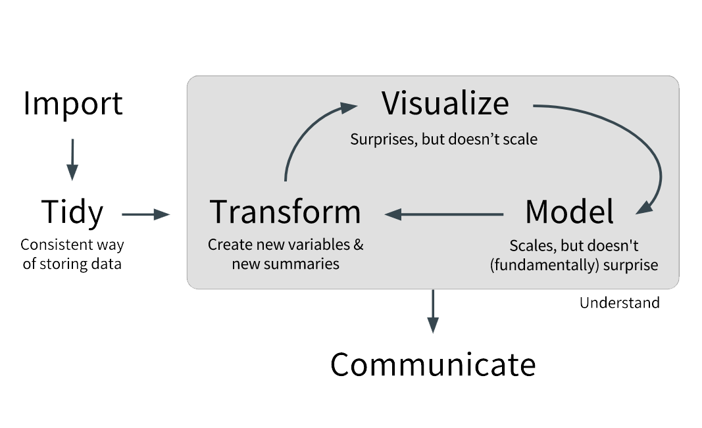

```{r setup, cache = FALSE, echo = FALSE, message = FALSE, warning = FALSE, tidy = FALSE}
library(knitr) 
options(width = 100)
opts_chunk$set(cache = F, message = F, error = F, warning = F, comment = NA, tidy = F, fig.path = 'fig/', fig.align = 'center')

options(xtable.type = 'html')
knit_hooks$set(inline = function(x) {
  if(is.numeric(x)) {
    round(x, getOption('digits'))
  } else {
    paste(as.character(x), collapse = ', ')
  }
})
knit_hooks$set(plot = knitr:::hook_plot_html)
```

# Introducción

A menudo me dicen que R es difícil. ¡No lo es! El comentario tiene su raíz en que Excel y R son muy distintos entre si. Lo mismo en el caso de SPSS.

R es un lenguaje de programación que otorga una amplia variedad de técnicas estadísticas y gráficas y además es altamente extendible. R se creó con la finalidad de ser flexible más que ser fácil de usar, pero eso ha ido cambiando en las últimas versiones.

---

# R versus Excel

Excel
* Limitado a tablas
* Compatible con XLSX, XLSC y CSV/TSV

R
* Múltiples estructuras de datos (vector, matriz, lista, unión)
* Nos centraremos en las uniones, en particular en las tablas
* Compatible con los formatos de Excel, SPSS, Stata y Bases de Datos

---

# Tidy Data

¿Qué significa en la práctica?

* Cada variable forma una columna
* Cada observación forma una fila
* Cada unidad observacional forma una tabla


Tldr; esta es la 3era forma normal de Codd.

---

# La filosofía del curso



---

# Google Sheets

Funciones básicas que deberían manejar:

* SUM()
* SUMIF()
* VLOOKUP()

---

# Google Sheets

## SUM()

<h3 style="font-family: 'Source Code Pro',monospace;">
SUM(RANGO)
<br>
=SUM(A2:A100)
<br>
=SUM(1,2,3,4,5)
<br>
=SUM(1,2,A2:A50)
</h3>

---

# Google Sheets

## SUMIF()

<h3 style="font-family: 'Source Code Pro',monospace;">
SUMIF(RANGO, CRITERIO, RANGO SUMA)
<br>
SUMIF(A1:A10,">20")
<br>
SUMIF(A1:A10,"Santiago Centro",B1:B10)
</h3>

---

# Google Sheets

## VLOOPKUP()

<h3 style="font-family: 'Source Code Pro',monospace;">
VLOOPKUP(VALOR BUSCADO, RANGO, INDICE, ORDENADO)
<br>
VLOOKUP(10003, A2:B26, 2, FALSE)
</h3>

---

# Google Sheets

## Actividad de repaso

Veamos el archivo [lecture1_officesupplies](https://goo.gl/bp22w9)

1. Crea una copia de la tabla en tu cuenta de Google Drive
2. En una nueva hoja lleva la tabla a formato tidy
3. Crea una columna que muestre el ingreso correspondiente a cada registro
4. En una nueva hoja para cada tabla muestra Las unidades vendidas totales por:
  1. Región
  2. Item
  3. Por región e item

---

# R y RStudio

El problema para los usuarios nuevos es que si descargas R desde CRAN, The Comprehensive R Archive Network, el sitio oficial, obtienes una terminal y una interfaz gráfica muy limitada. 

Un entorno de desarrollo integrado (IDE) como RStudio entrega una ventana con paneles organizados como en SPSS. Esto es como comprar el motor (R) y el resto del automóvil (RStudio) por separado.

---

# Paquetes de R

R contempla muchas funciones, desde la media y la desviación estándar a funciones específicas para quienes se dedican a literatura o finanzas.

En lugar de proveer un instalador de varios GB con todas las funciones, la instalación de R provee un conjunto mínimo de funciones de amplio uso. Para extender la instalación básica la comunidad R ha organizado las distintas funciones en "paquetes" que son conjuntos de funciones ordenados por tópicos y siguen una lógica similar a la de los complementos del navegador de internet.

---

# Base R y Tidyverse

Base R es el núcleo de R, es lo que se obtiene al instalar R. Esta base viene del lenguaje S, otro lenguaje de programación, cuya primera versión es de 1976 y sobre esa base existen desarrollos nuevos.

El Tidyverse es un conjunto de paquetes de R con una filosofía común y están diseñados para trabajar en conjunto y simplificar diferentes tareas que se pueden hacer con base R.

---

# ¡Eficiencia, Eficiencia, Eficiencia!

* Para aprovechar eficientemente el tiempo de la clase la instalación de R quedará para el final
* Vamos a usar RStudio Server
* Para la clase todo lo necesario ya está configurado en el servidor.

---

# Instalación de paquetes de R

Veremos el uso básico de los siguientes paquetes de R que son parte del Tidyverse:

* `readr`: importar CSV, TSV y similares
* `readxl`: importar XLSX y XLS
* `dplyr`: manipulación de datos
* `ggplot2`: gráficos
* `forcats`: manejo de variables categóricas

Para usar lo anterior emplearemos `pacman`, un paquete de administración que carga e instala paquetes.

---

# ¿Cómo se usará lo anterior?


El ícono `%>%` corresponde al paquete `magrittr`, se carga automáticamente al cargar `dplyr` y permite conectar distintas funciones.

---

# Gramática de verbos

`dplyr` provee una serie de funciones que permiten modificar una tabla, esas funciones se han estructurado en forma de verbos:

* `select()`	seleccionar columnas
* `filter()` filtrar filas
* `arrange()`	reordenar filas
* `mutate()`	crear columnas
* `group_by()` agrupar por valores antes de realizar una operación (e.g. expresar promedios de los grupos *Santiago*, *Valdivia* y *Concepción* de la columna `X1`)
* `summarise()`	resumir valores (e.g. reducir la tabla y mostrar el sueldo promedio por grupo de la columna `X2` y el arriendo promedio por grupo de la columna `X3`)
* `ungroup()` desagrupar (e.g. si necesito realizar una operación posterior a la de `summarise()`)

---

## ¿Cómo operan los verbos?

Supongamos que `arriendos_por_region.csv` contiene 300 observaciones (100 por región) de los sueldos de trabajadores de *Santiago*, *Valdivia* y *Concepción* desplegados de la siguiente forma:

|X1      |X2     |X3    |
|--------|-------|------|
|Santiago|500000 |120000|
|Santiago|1200000|350000|
|etc...  |       |      |

<br>El arriendo y sueldo promedio ordenado en una tabla de 3x3 de menos a más sería:

```{r ejemplo_dplyr, eval = FALSE}
read_csv("arriendos_por_region.csv") %>% 
  group_by(X1) %>% # agrupar por región
  summarise(sueldo_promedio = mean(X2),
            arriendo_promedio = mean(X3)) %>% # calcular sueldo y arriendo promedio
  ungroup() %>% # desagrupar 
  arrange(X2,X3) # ordenar de menos a más
```

---

## Tarea Nº1

Abre RStudio Server, ve a File &rarr; New Project y crea un nuevo proyecto con tu nombre en un nuevo directorio (e.g *mauricio_vargas_clase_1*)

La próxima vez que quieras ver tus avances puedes ir al directorio del proyecto y abrir el archivo RProj para tener todo linkeado a ese directorio.

Ve a File &rarr; New &rarr; RScript para ir anotando lo que veremos a continuación

---

## Tarea Nº1

Ejecuta el siguiente código haciendo click en Run o presionando Ctrl/Cmd+Enter:

```{r tarea_1_1, eval = FALSE}
### instalar y cargar pacman usando Base R
if (!require("pacman")) install.packages("pacman")

### instalar y/o cargar lo ya mencionado usando pacman
p_load(readr,readxl,dplyr,ggplot2,forcats)
```

La primera línea instruye a la máquina a instalar `pacman` si no encuentra el paquete.

---

## Tarea Nº2

En R se puede leer CSV, JSON, XLSX y otros formatos incluyendo DTA y SAV. Para simplificar, por esta vez, usaremos `mpg` que es un dataset que incluye `ggplot2`.

Pasos a seguir:

1. En el panel de la derecha ir a Help y busca "mpg".
2. En el panel inferior ir a Console y teclea "mpg + Enter".
3. Filtrar y ver los modelos lanzados después del año 2000 (columna `year`) y que tienen 4 cilindros (columna `cyl`)
4. Filtrar por tipo de transmisión (`trans`) y por millas por galón en ciudad (`cty`) y millas por galón en autopista (`hwy`) descendentemente.
5. Filtrar los automóviles de 4 o más cilindros hechos en el año 2008 y ordenados ascendentemente por `cty`.

---

## Desarrollo Tarea Nº2

### Paso 3:

```{r tarea_2_3, eval = FALSE}
mpg %>% 
  filter(year > 2000,
         cyl == 4)
```

---

## Desarrollo Tarea Nº2

### Paso 4:

```{r tarea_2_4, eval = FALSE}
mpg %>% 
  arrange(trans)

mpg %>% 
  arrange(-cty)

mpg %>% 
  arrange(trans,desc(cty),desc(hwy))
```

¡Esto no es posible de hacer en Excel excepto si se usa tablas dinámicas!

---

## Desarrollo Tarea Nº2

### Paso 5:

```{r tarea_2_5, eval = FALSE}
mpg %>% 
  filter(year == 2008, cyl == 4) %>% 
  arrange(cty)
```

---

## Tarea Nº3

Vamos a usar el archivo [lecture1_officesupplies.xlsx](https://visualizacion-uc.github.io/procesamiento-y-analisis-de-datos/datasets/lecture1_officesupplies.xlsx) y lo vamos a descargar y leer desde R.

Pasos a seguir:

1. Crear el directorio "datasets" y descargar el archivo si y sólo si este no está en el directorio "datasets"
2. Leer el archivo XLSX usando la función `read_excel` (una función del paquete `readxl`) y obtener las unidades vendidas totales por región, por item y por región e item
3. Obtener el ingreso total por región e item
4. Modificar el dataset original para agregar una columna de ingreso y guardar los resultados usando la función `write_csv` (una función del paquete `readr`)

---

## Desarrollo Tarea Nº3

### Paso 1:

¡No olvidar ir guardando los cambios!

```{r tarea_3_1, eval = FALSE}
folder = "datasets/"
file = paste0(folder,"lecture1_officesupplies.xlsx") 
### "paste0" pega elementos sin espacios
### "paste" agrega espacios

try(dir.create(folder))

if(!file.exists(file)) {
  download.file(
    "https://visualizacion-uc.github.io/procesamiento-y-analisis-de-datos/datasets/lecture1_officesupplies.xlsx",
    file)
}
```

---

## Desarrollo Tarea Nº3

### Paso 2:

```{r tarea_3_2, eval = FALSE}
officesupplies = read_excel(file)

### vista rápida de las columnas
str(officesupplies)

### convertir la columna Units a enteros
officesupplies = officesupplies %>% mutate(Units = as.integer(Units))

### regiones distintas
officesupplies %>% select(Region) %>% distinct()

### items distintos
officesupplies %>% select(Item) %>% distinct()
```

---

## Desarrollo Tarea Nº3

### Paso 2 (continuación):

```{r tarea_3_3, eval = FALSE}
### unidades totales por región
officesupplies %>% 
  select(Region,Units) %>%
  group_by(Region) %>% 
  summarise(Sold_Units = sum(Units))

### unidades totales por item
officesupplies %>% 
  select(Item,Units) %>% 
  group_by(Item) %>% 
  summarise(Sold_Units = sum(Units))

### unidades totales por region e item
officesupplies %>% 
  select(Region,Item,Units) %>% 
  group_by(Region,Item) %>% 
  summarise(Sold_Units = sum(Units))
```

---

## Desarrollo Tarea Nº3

### Paso 3:

```{r tarea_3_4, eval = FALSE}
### ingreso por región e item
officesupplies %>% 
  select(Region,Item,Units,`Unit Price`) %>% 
  rename(Unit_Price = `Unit Price`) %>% 
  group_by(Region,Item) %>% 
  summarise(Income = sum(Units * Unit_Price))
```

---

### Paso 4:

```{r tarea_3_5, eval = FALSE}
officesupplies = officesupplies %>% 
  select(Region,Item,Units,`Unit Price`) %>% 
  rename(Unit_Price = `Unit Price`) %>% 
  mutate(Income = Units * Unit_Price) %>% 
  write_csv(paste0(folder,"lecture1_office_supplies.csv"))
```

---

## Tarea Nº4

Vamos a usar el archivo [lecture1_copper.csv](https://visualizacion-uc.github.io/procesamiento-y-analisis-de-datos/datasets/lecture1_copper.csv) y lo vamos a descargar y leer desde R.

Pasos a seguir:

1. Crear el directorio "datasets" y descargar el archivo si y sólo si este no está en el directorio "datasets"
2. Leer el archivo CSV usando la función `read_csv` (una función del paquete `readr`) y convierte la columna `product` de `chr` a `factor` (para poder mostrar mejor la información en el paso 3)
  1. En lugar de `copper` deberás mostrar *Cobre*
  2. En lugar de `other` deberás mostrar *Pulpa de madera, fruta, salmón y otros*
3. Crea un gráfico de línea con las siguientes características
  1. El *eje x* debe ser el año (mostrar todos los años) y el *eje y* las exportaciones
  2. Coloreado por producto con los colores `c("#40b8d0", "#b2d183")` y con ancho de línea de `1.5`
  3. El *eje x* debe mostrar todos los años
  4. El título debe ser *Composición de las exportaciones a China ($)* y el subtítulo debe ser *Fuente: Aduana de Chile*

---

## Desarrollo Tarea Nº4

### Paso 1:

```{r tarea_4_1, eval = FALSE}
folder = "datasets/"
file = paste0(folder,"lecture1_copper.csv") 
### "paste0" pega elementos sin espacios
### "paste" agrega espacios

try(dir.create(folder))

if(!file.exists(file)) {
  download.file(
    "https://visualizacion-uc.github.io/procesamiento-y-analisis-de-datos/datasets/lecture1_copper.csv",
    file)
}
```

---

## Desarrollo Tarea Nº4

### Paso 2:

```{r tarea_4_2, eval = FALSE}
copper = read_csv(file)

### vista rápida de las columnas
str(copper)

### convertir a factor
copper = copper %>% 
  mutate(product = factor(product, levels = c("copper","others"),
                          labels = c("Cobre ","Pulpa de madera, fruta, salmón y otros")))
```

---

## Desarrollo Tarea Nº4

### Paso 3:

```{r tarea_4_3, eval = FALSE}
copper %>% 
  ggplot(aes(y = export, x = year, colour = product)) + 
  geom_line(size = 1.5) + 
  scale_x_continuous(breaks = seq(2006,2014,1)) +
  labs(title = "Composici\u00f3n de las exportaciones a China ($)", 
       subtitle = "Fuente: Aduana de Chile",
       x = "A\u00f1o", 
       y = "Millones de d\u00f3lares") + 
  scale_colour_manual(values = c("#40b8d0", "#b2d183"))
```

---

## Tarea Nº5

A partir de lo anterior crea un gráfico de área y luego un gráfico de área y uno de barras revirtiendo el orden en que se muestran las series.

---

## Desarrollo Tarea Nº5

### Parte 1:

```{r tarea_5_1, eval = FALSE}
copper %>% 
  ggplot(aes(y = export, x = year, fill = product)) + 
  geom_area() + 
  scale_x_continuous(breaks = seq(2006,2014,1)) + 
  labs(title = "Composici\u00f3n de las exportaciones a China ($)", 
       subtitle = "Fuente: Aduana de Chile",
       x = "A\u00f1o", 
       y = "Millones de d\u00f3lares") + 
  scale_fill_manual(values = c("#40b8d0", "#b2d183"))
```

---

## Desarrollo Tarea Nº5

### Parte 2:

```{r tarea_5_2, eval = FALSE}
copper %>% 
  ggplot(aes(y = export, x = year, fill = fct_rev(product))) + 
  geom_area() + 
  scale_x_continuous(breaks = seq(2006,2014,1)) + 
  labs(title = "Composici\u00f3n de las exportaciones a China ($)", 
       subtitle = "Fuente: Aduana de Chile",
       x = "A\u00f1o", 
       y = "Millones de d\u00f3lares") + 
  scale_fill_manual(values = c("#b2d183","#40b8d0"))
```

---

## Desarrollo Tarea Nº5

### Parte 3:

```{r tarea_5_3, eval = FALSE}
copper %>%
  ggplot(aes(y = export, x = year, fill = fct_rev(product))) + 
  geom_col() + 
  scale_x_continuous(breaks = seq(2006,2014,1)) +
  labs(title = "Composici\u00f3n de las exportaciones a China ($)", 
       subtitle = "Fuente: Aduana de Chile",
       x = "A\u00f1o", 
       y = "Millones de d\u00f3lares") + 
  scale_fill_manual(values = c("#b2d183","#40b8d0"))
```

---

## Tarea Nº6

Ahora mejora el gráfico de barras anterior:

1. Agrega etiquetas de datos a las series
2. Arregla los colores del fondo y mueve la leyenda a la parte inferior

---

## Desarrollo Tarea Nº6

### Parte 1:

```{r tarea_6_1, eval = FALSE}
chart = copper %>%
  group_by(year) %>% 
  mutate(pos = cumsum(export) - (0.5 * export)) %>% 
  ggplot(aes(y = export, x = year, fill = fct_rev(product))) + 
  geom_col() + 
  geom_text(aes(x = year, y = pos, label = export), colour = "black", 
            size = 4, show.legend = F) + 
  scale_x_continuous(breaks = seq(2006,2014,1)) +
  labs(title = "Composici\u00f3n de las exportaciones a China ($)", 
       subtitle = "Fuente: Aduana de Chile",
       x = "A\u00f1o", 
       y = "Millones de d\u00f3lares")
```

---

## Desarrollo Tarea Nº6

### Parte 2:

```{r tarea_6_2, eval = FALSE}
chart +
  scale_fill_manual(values = c("#b2d183","#40b8d0")) + 
  theme_bw() +
  theme(legend.position = "bottom", legend.direction = "horizontal", 
        legend.title = element_blank()) +
  guides(fill = guide_legend(reverse = T))
```

---

## Tarea Nº7

Selecciona todos los archivos de tu projecto en RStudio Server y exporta tus archivos para bajarlos en zip.

Si el alcanza el tiempo, instala R y RStudio en tu propio notebook.

* [Descargar R](https://cran.r-project.org/)

* [Descargar RStudio](https://www.rstudio.com/products/rstudio/download/#download)
